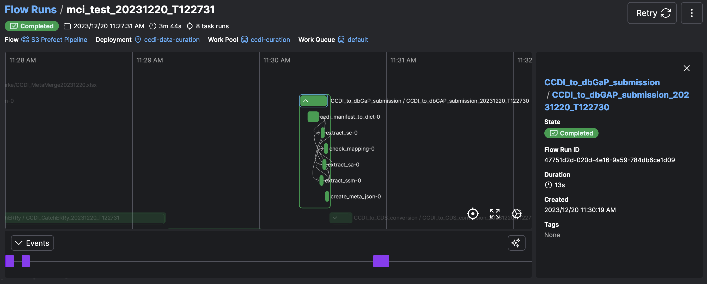
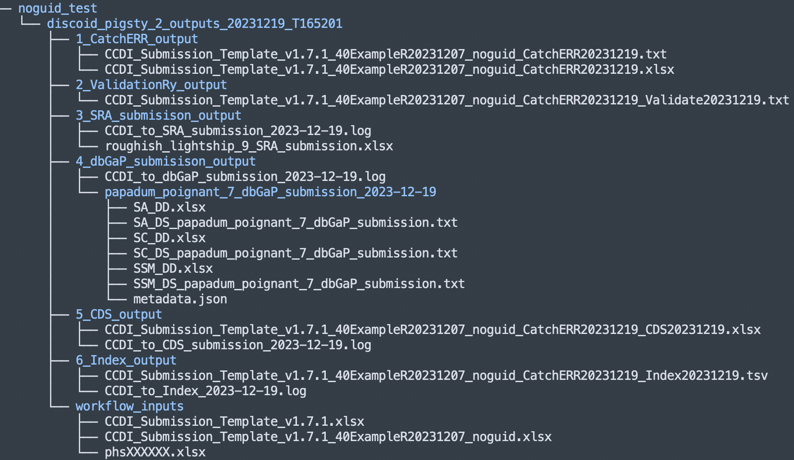

# ChildhoodCancerDataInitiative-Prefect_Pipeline

This repo contains the source code for a Prefect workflow that is deployed in the `ccdi-workspace` of Prefect Cloud. The workflow performs data curation and validation based on a **Childhood Cancer Data Initiative** (CCDI) manifest, and outputs submission files for different platforms. This workflow is custom-made for CCDI study ingestion in an effort to simplify and expedite the data ingestion process in a standard manner. Please login to the Prefect Cloud to execute the workflow.

## Contents

- [Workflow overlook](#workflow-overlook)
- [Prefect login instruction](#prefect-login-instruction)
- [Exucute a workflow](#execute-a-workflow)
- [Workflow outputs](#workflow-outputs)

---
### Workflow overlook
> 📌 This workflow expects a CCDI manifest in the `latest` version as input. The current workflow was tested using CCDI data model v1.7.1

The current workflow contains 4 subflow/steps during execution. All these steps were modified based on previously developed Python scripts.  
- [CatchERRy](https://github.com/CBIIT/ChildhoodCancerDataInitiative-CatchERRy)
- [ValidatoRy](https://github.com/CBIIT/ChildhoodCancerDataInitiative-Submission_ValidatoRy)
- [CCDI_to_SRAy](https://github.com/CBIIT/ChildhoodCancerDataInitiative-CCDI_to_SRAy)
- [CCDI_to_dbGaPy](https://github.com/CBIIT/ChildhoodCancerDataInitiative-CCDI_to_dbGaPy)

### Prefect login instruction

- Make sure you have received the invitation to join [Prefect](https://app.prefect.cloud/auth/login)
- Use your email address to get the login link or code

- Navigate to `ccdi-workspace`

### Execute a workflow

- Find the deployment

    A [**Deployment**](https://docs.prefect.io/latest/concepts/deployments/) is a server-side representation of a workflow. The deployment decides **when, where, and how** a workflow should run.

- Click `Custom Run`

- Provide inputs for the deployment.

    The only required two fields for deployment are `file_path` and `runner`. 
    - The `file_path` is the path of the CCDI manifest in the s3 `ccdi-validation` bucket. 
    - The `runner` is a uniq id of your choice. Please avoid space in your runner name. All the workflow outputs will be stored in the s3 bucket under the folder `runner`.
    
- Check flow run 

- Check subflow

### Workflow outputs
If finished successfully, the outputs of your workflow will be uploaded to s3 bucket (ccdi-validation) under the folder `<runner>/<phs_accession>_outputs_<date>_T<time>`. The outputs of all workflows from the same runner can be found under `/<runner>` folder.

